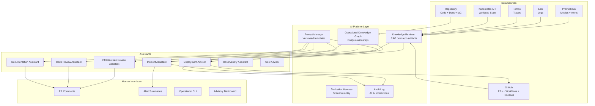

# AI Architecture

## Purpose

Define the architecture for AI-assisted capabilities on this platform. Every assistant component has explicit responsibilities, inputs, outputs, boundaries, and approval requirements.

**Design constraints (non-negotiable):**

1. AI never executes production-affecting actions without human approval
2. Every assistant is independently testable, reviewable, and removable
3. All recommendations carry evidence citations and confidence scores
4. Assistants operate on read-only data unless explicitly granted write scope
5. No assistant bypasses existing controls (SLO gate, canary stages, branch protection)

---

## Architecture Overview

---

## Component Definitions

### 1. Incident Assistant

| Attribute | Definition |
|-----------|-----------|
| **Responsibilities** | Summarize active alerts; correlate related alerts into incident groups; link relevant runbooks; identify recent deployments; generate ranked root-cause hypotheses; draft incident timelines; draft postmortems |
| **Inputs** | Alertmanager webhook events; Prometheus query results; Loki log queries; deployment history (GitHub releases + workflow runs); knowledge graph relationships; postmortem history |
| **Outputs** | Incident summary (markdown); correlated alert groups; hypothesis list with evidence + confidence; timeline draft; postmortem draft |
| **Boundaries** | Read-only access to metrics/logs/traces. Cannot acknowledge alerts, modify alert rules, or execute remediation. Cannot declare or close incidents. |
| **Approval requirements** | All outputs are advisory. Remediation actions require human execution per runbook. Postmortem drafts require human review before publication. |
| **Removal impact** | None — alerting and runbooks function independently |

**Detailed design:** [06-incident-assistant.md](06-incident-assistant.md)

---

### 2. Deployment Advisor

| Attribute | Definition |
|-----------|-----------|
| **Responsibilities** | Review deployments before promotion: error rates, latency trends, SLO budget state, canary health, rollback history, migration risk, dependency changes, infrastructure drift |
| **Inputs** | Prometheus SLO metrics; `check-slo-gate.sh` output; canary stage metrics; PR diff metadata; migration files in changeset; Dependabot PR history; `terraform-drift.yml` results |
| **Outputs** | Recommendation: PROCEED / DELAY / INVESTIGATE / ROLLBACK with explanation; risk factors list; evidence citations |
| **Boundaries** | Advisory only. Cannot approve, block, or trigger deployments. Cannot override the SLO gate. Runs alongside existing gates, never replacing them. |
| **Approval requirements** | Human reviews recommendation in PR/workflow context. Deployment proceeds through existing approval chain (workflow_dispatch with environment protection). |
| **Removal impact** | None — SLO gate and canary stages remain |

**Detailed design:** [07-deployment-advisor.md](07-deployment-advisor.md)

---

### 3. Infrastructure Review Assistant

| Attribute | Definition |
|-----------|-----------|
| **Responsibilities** | Review Terraform plans, Kubernetes manifests, Helm values, IAM changes, network policies; estimate cost impact; flag security concerns |
| **Inputs** | `terraform plan` JSON output; manifest diffs from PRs; Helm values diffs; module documentation; `docs/security/iam-least-privilege.md` constraints; cost baseline from `docs/cost/estimates.md` |
| **Outputs** | Review comments: security findings, cost estimates, blast radius assessment, convention violations; each with severity and evidence |
| **Boundaries** | Cannot apply Terraform, modify manifests, or change IAM. Comments are advisory within existing PR review flow. |
| **Approval requirements** | Human reviewer must resolve or acknowledge all findings before merge. Terraform apply remains manual per `terraform-plan.yml` design. |
| **Removal impact** | None — plan review workflow and manual apply remain |

**Detailed design:** [08-infrastructure-review.md](08-infrastructure-review.md)

---

### 4. Code Review Assistant

| Attribute | Definition |
|-----------|-----------|
| **Responsibilities** | Pre-review PRs for: architecture consistency (ADR compliance), coding standards (golangci conventions), security issues, performance regressions, observability coverage, documentation updates, test completeness |
| **Inputs** | PR diff; ADR corpus (20 documents); `.golangci.yml` rules; existing test patterns; package structure conventions |
| **Outputs** | Inline PR comments categorized by type (architecture/security/performance/testing/docs); summary assessment; confidence per finding |
| **Boundaries** | Comments complement human review, never replace it. Cannot approve or request changes. Cannot modify code. |
| **Approval requirements** | Human reviewer retains full approval authority. AI comments are dismissible with reason. |
| **Removal impact** | None — golangci-lint and human review remain |

---

### 5. Documentation Assistant

| Attribute | Definition |
|-----------|-----------|
| **Responsibilities** | Detect documentation drift (docs vs. actual configs); suggest missing ADRs; generate API docs from OpenAPI spec; draft release summaries; update onboarding material |
| **Inputs** | Documentation corpus; git history; OpenAPI spec; actual configuration files; release-please changelogs |
| **Outputs** | Drift reports (doc X says Y, config says Z); ADR suggestions; doc update PRs; release summaries |
| **Boundaries** | Generates PRs, never pushes directly. All documentation changes go through standard review. |
| **Approval requirements** | Doc PRs require human review and merge approval. |
| **Removal impact** | None — documentation process unchanged |

**Detailed design:** [09-documentation-assistant.md](09-documentation-assistant.md)

---

### 6. Observability Assistant

| Attribute | Definition |
|-----------|-----------|
| **Responsibilities** | Summarize dashboard state; explain anomalies in context; identify noisy alerts; recommend dashboard improvements; detect missing telemetry |
| **Inputs** | Grafana dashboard definitions (5 JSON files); Prometheus recording rules (201 lines); alert firing history; metric metadata |
| **Outputs** | State summaries; anomaly explanations (statistical vs. confirmed incident); noise reports; coverage gap reports |
| **Boundaries** | Read-only. Cannot modify alert rules, recording rules, or dashboards. Recommendations become PRs reviewed by humans. |
| **Approval requirements** | Rule changes follow standard PR review. |
| **Removal impact** | None — monitoring stack unchanged |

---

### 7. Cost Advisor

| Attribute | Definition |
|-----------|-----------|
| **Responsibilities** | Identify oversized resources, idle workloads, unused storage, excessive logging, inefficient autoscaling; estimate savings with operational impact assessment |
| **Inputs** | CloudWatch metrics; Cost Explorer data; Terraform resource definitions; autoscaling configuration; `docs/cost/estimates.md` baseline |
| **Outputs** | Optimization recommendations with estimated savings, risk assessment, and implementation steps |
| **Boundaries** | Cannot modify resources. Recommendations require human approval and Terraform PR process. |
| **Approval requirements** | All changes through Terraform PR workflow with human review. |
| **Removal impact** | None — cost management process unchanged |

---

## Platform Layer Components

### Knowledge Retriever

- **Purpose:** Provide grounded context to all assistants via retrieval-augmented generation
- **Sources:** Repository files, ADRs, runbooks, Terraform, manifests, metrics metadata, incidents, documentation
- **Guarantee:** Every retrieved chunk carries source path and line references
- **Design:** [10-retrieval-strategy.md](10-retrieval-strategy.md)

### Operational Knowledge Graph

- **Purpose:** Model relationships between services, infrastructure, alerts, runbooks, SLOs, ADRs, incidents, and deployments
- **Guarantee:** No invented relationships — all edges derived from parseable artifacts (alert annotations, imports, references)
- **Design:** [05-knowledge-model.md](05-knowledge-model.md)

### Prompt Manager

- **Purpose:** Version-controlled prompt templates with safety constraints, grounding requirements, and structured output schemas
- **Guarantee:** Prompts are tested, versioned, and auditable like code
- **Design:** [12-prompt-standards.md](12-prompt-standards.md)

### Evaluation Harness

- **Purpose:** Measure assistant quality via scenario replay, precision/recall metrics, and operator feedback
- **Guarantee:** No assistant ships without passing evaluation scenarios
- **Design:** [11-evaluation-framework.md](11-evaluation-framework.md)

### Audit Log

- **Purpose:** Record every AI interaction: input context, prompt version, model, output, human decision
- **Guarantee:** Complete auditability of AI influence on operational decisions
- **Design:** [13-governance.md](13-governance.md)

---

## Integration Points

| Assistant | Trigger | Delivery Channel | Frequency |
|-----------|---------|-----------------|-----------|
| Incident Assistant | Alertmanager webhook | Alert summary channel / CLI | Per alert group |
| Deployment Advisor | PR labeled `deploy` or workflow_dispatch | PR comment + workflow check | Per deployment |
| Infrastructure Review | PR touching `deploy/terraform/` or `deploy/kubernetes/` | PR comments | Per PR |
| Code Review | PR opened/updated | PR comments | Per PR |
| Documentation Assistant | Weekly schedule + post-merge hooks | Drift report + doc PRs | Weekly |
| Observability Assistant | On-demand + weekly schedule | Advisory dashboard | Weekly |
| Cost Advisor | Monthly schedule | Cost report | Monthly |

---

## Failure Modes and Safeguards

| Failure Mode | Safeguard |
|-------------|-----------|
| Assistant provides wrong recommendation | Evidence citations required; human approval gate; confidence scores |
| Assistant unavailable | All existing workflows function without AI (zero-dependency removal) |
| Prompt injection via PR content | Input sanitization; assistants cannot execute actions from retrieved content |
| Model hallucination | Grounding requirement — claims without retrieved evidence are flagged as ungrounded |
| Over-reliance on AI | Capability map marks intentionally-manual activities; training emphasizes verification |
| Audit gap | Audit log failures block assistant operation (fail-closed) |

---

## Technology Constraints

- Assistants must not introduce new stateful production dependencies
- Read-only access by default; write access only via PR creation
- All assistant code lives in a removable directory (`sre-toolkit/ai/` or standalone service)
- Model selection governed by [13-governance.md](13-governance.md)
- No production secrets exposed to model context
