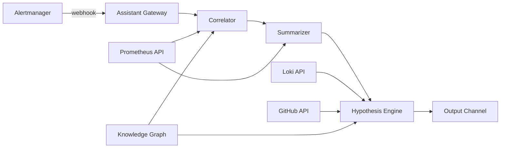

# Incident Assistant Design

## Purpose

Design an AI assistant that accelerates incident response by summarizing alerts, correlating signals, linking evidence, and drafting documentation — without ever executing remediation.

**Design basis:** Postmortem 001 shows a 47-minute incident with 12 minutes from first alert to on-call acknowledgment and 19 minutes to root cause identification. This assistant targets those gaps.

---

## Capabilities

### 1. Alert Summarization

**Input:** Alertmanager webhook payload (alert name, labels, annotations, firing time, values)

**Output:**

```markdown
## Alert Summary: DataStaleCritical

**What:** Market data is critically stale — no fresh data for >10 minutes.
**Service:** market-ingestor
**Severity:** Critical (pages on-call per severity matrix)
**SLO impact:** data-freshness (99% over 30d) — currently burning budget at ~6x
**Runbook:** docs/runbooks/data-freshness-alert.md

**Current state:**
- data_freshness_seconds: 743 (threshold: 600)
- Ingestion success rate: 0% over last 5m
- Circuit breakers: coingecko OPEN, coincap CLOSED

**Evidence:** [Prometheus query results, timestamped]
```

**Grounding rules:**
- Every numeric claim cites a specific PromQL query and timestamp
- SLO impact computed from recording rules in `monitoring/prometheus/recording-rules.yml`
- If a query returns no data, state "no data available" rather than guessing

---

### 2. Alert Correlation

**Input:** Set of currently firing alerts + knowledge graph causal chains

**Output:**

```markdown
## Correlated Incident Group

**Assessment:** These 3 alerts share a common causal chain (confidence: HIGH)

Chain (from knowledge graph, derived from postmortem 001 pattern):
1. HighRateLimitFrequency (fired 14:03) — CoinGecko returning 429s
2. PrimaryProviderDown (fired 14:05) — circuit breaker opened
3. DataStaleCritical (fired 14:12) — no fresh data >10 min

**Supporting evidence:**
- provider_rate_limited_total{provider="coingecko"}: 0.8/s since 14:03
- circuit_breaker_state{name="coingecko"}: 1 since 14:05
- Fallback provider (coincap): also failing (rate: 0/s) — explains why fallback did not recover

**Alternative explanation (confidence: LOW):**
- Redis stream failure could cause stale reads, but redis_up == 1 rules this out
```

**Correlation logic:**
1. Match firing alerts against known causal chains in knowledge graph
2. Verify temporal ordering (cause fires before effect)
3. Verify metric evidence for each link in the chain
4. Report unmatched alerts separately (may be independent incidents)

**Guardrails:**
- Never merge alerts from different services without evidence of causation
- Alerts with no known chain are reported as "uncorrelated — investigate independently"
- Confidence levels: HIGH (full chain verified), MEDIUM (partial verification), LOW (temporal only)

---

### 3. Recent Deployment Identification

**Input:** Incident start time, affected services

**Process:**
1. Query GitHub releases (release-please tags) for deployments in the 24h before incident start
2. Query workflow runs (`deploy-staging.yml`, `deploy-production.yml`) for completion times
3. Check `terraform-drift.yml` results for infrastructure changes
4. Cross-reference changed files with affected service packages

**Output:**

```markdown
## Deployments Near Incident Start (14:03 UTC)

| Time | Type | Ref | Relevance |
|------|------|-----|-----------|
| 11:47 | Production deploy | v1.14.2 (a3f8c21) | MEDIUM — touched internal/provider/ (rate limit config) |
| 09:12 | Terraform apply | PR #231 | LOW — DNS module only |

**Assessment:** The 11:47 deploy modified provider configuration 2h16m before incident.
Commit message: "feat(provider): reduce polling interval to 60s"
This change increased request frequency — consistent with rate-limit exhaustion.
```

---

### 4. Root Cause Hypotheses

**Input:** Correlated alert group, metric history, log patterns, deployment history, knowledge graph

**Output format (always multiple hypotheses, ranked):**

```markdown
## Hypotheses (ranked by evidence strength)

### H1: Provider rate limit exhaustion (confidence: 85%)
**Evidence:**
- provider_rate_limited_total climbing since 14:03 (0.8/s sustained)
- Matches postmortem 001 pattern exactly (same alert sequence, same provider)
- Deploy v1.14.2 reduced polling interval 2h prior
**Counter-evidence:** None found
**Verification:** Check Retry-After header values; compare request rate vs. free tier limit (10-30/min)

### H2: Fallback provider simultaneous failure (confidence: 40%)
**Evidence:**
- coincap success rate dropped to 0 at 14:06
**Counter-evidence:**
- CoinCap outage would be coincidental timing; no coincap error logs found
**Verification:** Query CoinCap status page; check coincap error codes in Loki

### H3: Redis stream backpressure (confidence: 5%)
**Evidence:** Weak — realtime_consumer_lag not elevated
**Counter-evidence:** redis_up == 1, stream length normal
**Verification:** XLEN market:prices
```

**Rules:**
- Minimum 2 hypotheses, maximum 5
- Each hypothesis requires at least one evidence citation
- Confidence = f(evidence strength, counter-evidence, historical pattern match)
- Never assert a single cause without corroborating evidence from 2+ signal types
- Explicitly state what would disprove each hypothesis

---

### 5. Runbook Recommendation

**Input:** Alert group, hypotheses, current system state

**Output:**

```markdown
## Recommended Actions

**Primary runbook:** docs/runbooks/provider-rate-limiting.md
**Secondary:** docs/runbooks/data-freshness-alert.md

**Suggested first diagnostic steps (from runbook, pre-verified):**
1. ✓ CONFIRMED: Rate limiting active (provider_rate_limited_total > 0.1/s)
2. → NEXT: Check current ingestion interval: `kubectl get deploy market-ingestor -o yaml | grep INTERVAL`
3. → NEXT: Verify fallback health: query circuit_breaker_state for all providers

**Historical precedent:** Incident 001 (2024-01-10) resolved by increasing ingestion
interval from 60s to 120s. Resolution time: 47 minutes total.
```

**Rules:**
- Recommendations reference runbook steps, never invent new procedures
- Pre-fill diagnostic results where metrics already answer the question
- Mark steps as CONFIRMED/CONTRADICTED/PENDING based on available data

---

### 6. Incident Timeline Generation

**Input:** Alert firing/resolution times, metric inflection points, deployment events, log patterns

**Output:** Timeline in postmortem format (matching `docs/postmortems/001` structure):

```markdown
## Draft Timeline (auto-generated, requires human validation)

| Time (UTC) | Event | Source |
|------------|-------|--------|
| 14:03 | CoinGecko begins returning 429 responses | provider_rate_limited_total inflection |
| 14:05 | Circuit breaker opens for coingecko | circuit_breaker_state == 1 |
| 14:08 | Data freshness degrades past 300s | data_freshness_seconds > 300 |
| 14:12 | Alert fires: DataStaleCritical | Alertmanager event |
| 14:15 | On-call acknowledges | Alertmanager ack event |

⚠️ GAPS: No events identified between 14:15 and 14:30 (investigation period).
Human should fill: acknowledgment details, communication events, manual actions.
```

**Rules:**
- Every event cites its data source
- Gaps are explicitly marked, never filled with speculation
- Timeline is a DRAFT — human validates and extends before use in postmortem

---

### 7. Postmortem Drafting

**Input:** Validated timeline, hypotheses, resolution events, impact metrics

**Output:** Draft following the established format in `docs/postmortems/001-primary-provider-rate-limit.md`:
- Summary table (date, duration, severity, impact, status)
- Timeline (from capability 6, human-validated)
- Root cause (from confirmed hypothesis, human-confirmed)
- Impact (quantified from metrics: missed cycles, stale duration, affected SLOs)
- Lessons learned (suggested, human-owned)
- Action items (extracted from resolution, human-assigned)

**Rules:**
- Severity assigned per `docs/operations/severity-matrix.md` criteria (suggested, human confirms)
- "Lessons Learned" section is suggested language only — explicitly marked as draft
- Never assigns blame; focuses on system behavior per postmortem 001 style

---

## Integration Architecture



**Trigger:** Alertmanager webhook on alert group transitions (firing/resolved)
**Delivery:** Structured message to on-call channel + CLI query interface
**Latency target:** Summary within 30s of alert group firing

---

## Boundaries and Safety

| The assistant CAN | The assistant CANNOT |
|-------------------|---------------------|
| Query Prometheus, Loki, Tempo (read-only) | Acknowledge or silence alerts |
| Read GitHub releases and workflow runs | Trigger rollbacks or restarts |
| Recommend runbook steps | Execute any remediation |
| Draft timelines and postmortems | Publish postmortems without review |
| Cite historical incidents | Declare or close incidents |
| Express confidence levels | Assert certainty without evidence |

**Escalation:** If the assistant cannot correlate alerts or generate hypotheses (insufficient data), it explicitly states "Unable to assess — manual investigation required" and provides raw query links.

---

## Evaluation Criteria

| Metric | Target | Measurement |
|--------|--------|-------------|
| Summary accuracy | >95% claims verified correct | Human review of 20 consecutive summaries |
| Correlation precision | >90% (grouped alerts truly related) | Replay against known incident scenarios |
| Hypothesis usefulness | Top-3 contains actual cause in >80% of cases | Scenario replay with injected failures |
| Time to summary | <30s from alert firing | Gateway latency metrics |
| False correlation rate | <5% (unrelated alerts merged) | Weekly audit of correlation decisions |

**Evaluation method:** Replay failure injection scenarios (`sre-toolkit/inject_failures.py`: provider_429, provider_500, redis_failure, stale_data) and verify assistant output against known ground truth. See [11-evaluation-framework.md](11-evaluation-framework.md).
