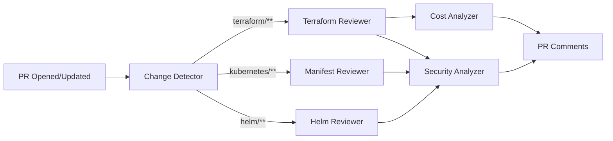

# Infrastructure Review Design

## Purpose

Design an AI assistant that reviews infrastructure changes — Terraform plans, Kubernetes manifests, Helm values, IAM policies, and network configurations — with cost analysis and security assessment.

**Design basis:** The platform has 13 Terraform modules across 3 environments, a drift detection workflow (`terraform-drift.yml`), a plan review workflow (`terraform-plan.yml`), and documented security constraints (`docs/security/iam-least-privilege.md`, `docs/security/threat-model.md`).

---

## Review Workflows

### 1. Terraform Plan Review

**Trigger:** PR touching `deploy/terraform/**` (extends existing `terraform-plan.yml`)

**Input:** `terraform plan -json` output, module source, environment target

**Review dimensions:**

| Dimension | Checks | Severity Range |
|-----------|--------|---------------|
| Security | IAM policy widening, security group ingress changes, encryption removal, public exposure, KMS key changes | CRITICAL–LOW |
| Cost | Instance size changes, storage increases, new NAT gateways, Multi-AZ toggles, backup retention | HIGH–INFO |
| Blast radius | Resources affected count, destroy operations, module shared across environments | HIGH–INFO |
| Consistency | Deviation from module patterns, hardcoded values vs. variables, missing tags | MEDIUM–LOW |
| Reversibility | Destructive changes (force replacement), data loss risk | CRITICAL–INFO |

**Output format:**

```markdown
## Terraform Review: PR #245 (modules/rds, environment: prod)

### CRITICAL (1)

**[SEC-1] Storage encryption configuration change**
- Resource: aws_db_instance.main
- Change: `storage_encrypted = false` (was: true)
- Impact: Disables at-rest encryption on production database
- Constraint: docs/security/threat-model.md requires encryption at rest for all data stores
- Recommendation: Revert this change. If re-encryption is needed, use snapshot-restore path.

### HIGH (1)

**[COST-1] Instance class upgrade**
- Resource: aws_db_instance.main
- Change: db.t3.medium → db.r6g.xlarge
- Estimated cost impact: +$280/month (from docs/cost/estimates.md pricing basis)
- Justification needed: Current CPU/memory utilization not attached to PR
- Recommendation: Attach CloudWatch utilization data showing sustained >70% before approval

### Summary
- Resources changed: 2 (1 modify-in-place, 1 requires replacement: NO)
- Estimated monthly cost delta: +$280
- Environments affected: prod only
- Rollback complexity: LOW (plan is reversible for instance class; encryption change is NOT reversible in-place)
```

**Environment-specific rules:**
- `prod`: All CRITICAL findings block recommendation (human must explicitly override with documented reason)
- `staging`: CRITICAL findings are warnings
- `dev`: Informational only

---

### 2. Kubernetes Manifest Review

**Trigger:** PR touching `deploy/kubernetes/**` or `deploy/helm/**`

**Review dimensions:**

| Dimension | Checks |
|-----------|--------|
| Resource management | Requests/limits present, limits ≥ requests, no unbounded memory, CPU limits reasonable for workload type |
| Reliability | Liveness/readiness probes configured, probe timeouts sane, PDB for multi-replica services, graceful shutdown (preStop hook) |
| Security | No privileged containers, read-only root filesystem where possible, no hostNetwork/hostPID, service account scoped, Falco rule coverage (`deploy/kubernetes/base/monitoring/falco-rules.yaml`) |
| Scaling | HPA bounds consistent with `docs/deployment/autoscaling-strategy.md` (api: 2-10, ingestor: 1-5, realtime: 2-8, frontend: 2-6) |
| Consistency | Labels match conventions (`app.kubernetes.io/name`), namespace correct, image tag pinned (no `latest`) |

**Output format:**

```markdown
## Manifest Review: PR #246 (helm values-prod.yaml)

### MEDIUM (2)

**[K8S-1] Realtime HPA max replicas reduced below documented bound**
- Change: realtime.maxReplicas 8 → 4
- Constraint: docs/deployment/autoscaling-strategy.md documents 2-8 range based on
  connection load testing (load-tests/scale.js, 5000 VU)
- Risk: Connection saturation under peak load; realtime-delivery SLO (99.5%) at risk
- Recommendation: Attach load test evidence supporting the reduction, or keep max at 8

**[K8S-2] Memory limit reduction on market-api**
- Change: resources.limits.memory 512Mi → 256Mi
- Evidence: No OOM data attached; performance-engineering dashboard shows p99 heap ~310Mi
- Recommendation: Verify against dashboard before merge

### PASS
- Probes: configured, timeouts unchanged
- Security context: compliant
- Image tags: pinned to release SHA
```

---

### 3. Helm Chart Review

**Trigger:** PR touching `deploy/helm/cryptomarket/**`

**Checks:**
- Values consistency across environments (unintended prod/staging divergence)
- Chart version bumps with changelog reference
- Template changes: rendering validation (`helm template` output diff)
- Subchart (monitoring) changes cross-referenced with `monitoring/` source configs
- Default values safe (replicas, resource requests, probe settings)

---

### 4. IAM Review

**Trigger:** PR touching `deploy/terraform/modules/iam/**` or any `aws_iam_*` resource

**Constraint basis:** `docs/security/iam-least-privilege.md`

**Checks:**

| Pattern | Severity | Action |
|---------|----------|--------|
| `Action: "*"` or `Resource: "*"` added | CRITICAL | Flag with least-privilege alternative suggestion |
| New service role without IRSA pattern | HIGH | Reference existing IRSA module pattern |
| Policy attachment to existing role | MEDIUM | List effective permissions delta |
| Trust policy widening (new principals) | HIGH | Require explicit justification |
| Permission removal | INFO | Positive note (verify no dependent workloads) |

**Rules:**
- IAM findings are NEVER auto-resolved — human must explicitly address each
- Assistant suggests narrowed policy JSON but never applies it
- Cross-reference with `docs/security/threat-model.md` actor model

---

### 5. Network Policy Review

**Trigger:** PR touching security groups, NACLs, WAF rules (`modules/networking/`, `modules/waf/`)

**Checks:**
- Ingress from 0.0.0.0/0 on non-ALB ports → CRITICAL
- New ports opened without corresponding service documentation → HIGH
- WAF rule removal/disabling → HIGH with threat model reference
- Egress restrictions loosened → MEDIUM
- Cross-references: `docs/deployment/ingress-configuration.md` for expected traffic patterns

---

### 6. Cost Analysis

**Input:** Resource changes from plan, pricing basis from `docs/cost/estimates.md`

**Output:**

```markdown
## Cost Impact Summary

| Change | Monthly Delta | Notes |
|--------|--------------|-------|
| RDS db.t3.medium → db.r6g.xlarge | +$280 | Compute + memory upgrade |
| Backup retention 7d → 30d | +$15 | Estimated from snapshot storage |
| **Total** | **+$295/month** | **+8.2% vs. documented baseline** |

Baseline reference: docs/cost/estimates.md (total: ~$3,600/month prod)
```

**Rules:**
- Estimates carry ±30% uncertainty disclaimer
- Cost increases > 10% of baseline require explicit justification in PR
- Cost decreases flagged for verification (under-provisioning risk)

---

### 7. Security Analysis (Cross-Cutting)

Applied to all review types, grounded in `docs/security/threat-model.md`:

| Threat Category | Review Focus |
|----------------|-------------|
| Data exfiltration | S3 bucket policies, encryption changes, egress rules |
| Privilege escalation | IAM widening, service account changes |
| Supply chain | Image sources, chart provenance (ADR-017 constraints) |
| Denial of service | Resource limits removal, WAF disabling, autoscaling bounds |
| Tampering | Immutable infrastructure violations, mutable tags |

---

## Integration Architecture



**Delivery:** PR comments (one per finding, threaded), plus a summary comment with overall assessment.

**Blocking behavior:** The assistant never blocks PRs. Findings at CRITICAL severity add a `needs-security-review` label that routes to human reviewers per CODEOWNERS (`.github/CODEOWNERS`).

---

## Boundaries and Safety

| The assistant CAN | The assistant CANNOT |
|-------------------|---------------------|
| Analyze plan output and diffs | Apply Terraform changes |
| Estimate costs from documented pricing | Access billing APIs without governance approval |
| Suggest hardened configurations | Modify IAM policies |
| Label PRs for human review | Block or merge PRs |
| Reference security documentation | Create new security policy |

---

## Evaluation Criteria

| Metric | Target | Measurement |
|--------|--------|-------------|
| Finding precision | >85% of findings confirmed valid by reviewer | Reviewer feedback (resolve/dismiss tracking) |
| Critical miss rate | 0 security incidents traced to a missed review finding | Incident cross-reference (quarterly) |
| Cost estimate accuracy | Within ±30% of actual invoice impact | Monthly cost review comparison |
| Reviewer time saved | >30% reduction in infrastructure PR review time | Before/after measurement over 20 PRs |
| Noise level | <15% of findings dismissed as invalid | Dismissal tracking |
