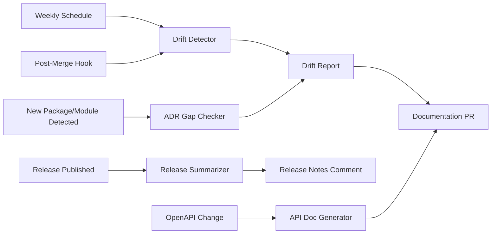

# Documentation Assistant Design

## Purpose

Design an AI assistant that maintains documentation accuracy: detecting drift between docs and reality, suggesting missing decision records, generating API documentation, and keeping onboarding material current.

**Design basis:** The repository contains 70+ markdown documents, an OpenAPI specification (`api/openapi.yaml`), 20 ADRs, and release-please changelog automation. Documentation quality is high (readiness score: 4/5) but freshness tracking is absent.

---

## Capabilities

### 1. Documentation Drift Detection

**Problem:** Documents describe system state that may diverge from actual configuration over time.

**Drift checks:**

| Doc Location | Verified Against | Detection Method |
|-------------|-----------------|-----------------|
| `docs/architecture/overview.md` (ports, endpoints) | `internal/api/` route registrations, Makefile smoke targets | Parse route definitions; compare endpoint lists |
| `docs/architecture/overview.md` (replica counts: api 2-10, ingestor 1-5, realtime 2-8, frontend 2-6) | Helm values files | Parse HPA min/max; compare |
| `docs/sre/slos.md` (SLO targets, PromQL formulas) | `monitoring/prometheus/recording-rules.yml`, alert thresholds | Extract formulas; diff |
| `docs/deployment/autoscaling-strategy.md` | Helm values + HPA manifests | Compare bounds and metrics |
| `docs/runbooks/*` (alert names referenced) | `monitoring/prometheus/alerts.yml` alert names | Validate all referenced alerts exist |
| `docs/onboarding.md` (commands, ports) | Makefile targets, docker-compose.yml | Validate commands exist and ports match |
| `docs/cost/estimates.md` | Terraform module configurations | Compare instance classes, storage sizes |
| `docs/operations/logging.md` (log format, fields) | `internal/telemetry/` implementation | Compare documented fields against code |
| Mermaid diagrams (service topology) | `docker-compose.yml` services, K8s manifests | Compare node lists |

**Output format:**

```markdown
## Documentation Drift Report — 2024-03-15

### DRIFT DETECTED (2)

**[DRIFT-1] docs/sre/slos.md — API Latency threshold**
- Documented: "Threshold: 300ms for 99th percentile"
- Actual: Alert APIHighLatency fires at 500ms (monitoring/prometheus/alerts.yml:144)
- Assessment: SLO (300ms) and alert threshold (500ms) may be intentionally different,
  but this is not explained in either document.
- Suggested action: Add note to slos.md explaining alert vs. SLO threshold relationship
- Confidence: HIGH (direct text comparison)

**[DRIFT-2] docs/onboarding.md — Grafana port**
- Documented: "Grafana at http://localhost:3001"
- Actual: docker-compose.yml maps Grafana to port 3002 (changed in commit b4e2f1a)
- Suggested action: Update onboarding.md port reference
- Confidence: HIGH

### CONSISTENT (14 checks passed)
- Architecture endpoints match API routes ✓
- Replica bounds match Helm values ✓
- All runbook alert references valid ✓
- [... truncated]

### UNVERIFIABLE (1)
- docs/multi-region/* — describes future state; no current infrastructure to verify against
```

**Schedule:** Weekly (GitHub Actions scheduled workflow) + on-demand via CLI.

---

### 2. Missing ADR Detection

**Problem:** Architectural decisions made in code or PRs without corresponding ADR documentation.

**Detection heuristics:**

| Signal | Method |
|--------|--------|
| New package under `internal/` with no ADR reference | Compare package creation commits against ADR corpus |
| New external dependency in `go.mod` (non-patch) | Flag for decision documentation |
| Infrastructure pattern change (new module, new service type) | Compare Terraform module list against documented architecture |
| PR discussion containing decision language ("let's use X instead of Y") | Scan merged PR bodies for decision patterns |
| Configuration changes contradicting existing ADR | Compare change against ADR constraints |

**Output:**

```markdown
## ADR Gap Report

### SUGGESTED: New ADR needed

**[GAP-1] WebSocket package added (internal/websocket/)**
- ADR-003 documents "SSE over WebSockets" as the chosen realtime delivery mechanism
- Commit 7c3d9e2 adds internal/websocket/ package
- Question: Does this supersede ADR-003, complement it, or is it for a different purpose?
- Suggested ADR title: "021-websocket-usage-scope.md"
- Action required: Human must author the decision context — AI cannot determine intent
```

**Rules:**
- Suggestions are questions, not assertions
- Human authors all ADR content (decisions are human-owned per capability map)
- Assistant provides the template and relevant context (related ADRs, code references)

---

### 3. API Documentation Generation

**Input:** `api/openapi.yaml` (source of truth)

**Outputs:**
- Endpoint reference documentation (generated, marked as auto-generated)
- Change summary when spec changes ("New endpoint added: GET /coins/{symbol}/history")
- Consistency check: spec vs. actual route registrations in `internal/api/`

**Rules:**
- Generated docs carry header: "Auto-generated from api/openapi.yaml — do not edit directly"
- Spec-vs-implementation mismatches reported as drift, not silently resolved
- Human reviews generated output before publication (PR-based workflow)

---

### 4. Release Summaries

**Input:** release-please changelogs, conventional commit history, PR descriptions

**Output:**

```markdown
## Release Summary: v1.15.0 (2024-03-15)

### User-Facing Changes
- Price history endpoint now supports 7-day range (feat: #238)

### Operational Changes
- Ingestion interval configurable via INGEST_INTERVAL env var (feat: #241)
- New alert: ProviderDataMismatch for cross-provider price divergence (feat: #239)

### Infrastructure
- No Terraform changes in this release

### Risk Notes
- #241 changes provider request frequency — monitor HighRateLimitFrequency alert
  (related: postmortem 001, docs/runbooks/provider-rate-limiting.md)

### SLO Relevance
- No changes to SLO-related code paths identified
```

**Delivery:** Posted to release PR and appended to changelog PR as a comment (human decides whether to include in release notes).

---

### 5. Onboarding Material Maintenance

**Input:** `docs/onboarding.md`, Makefile, docker-compose.yml, repository structure

**Checks:**
- All `make` commands referenced in onboarding exist in Makefile
- All URLs/ports match current configuration
- Prerequisites list matches `.devcontainer/devcontainer.json` and CI tool versions
- New services/features added since last onboarding update (compare git history)

**Output:** Suggested updates as a PR with tracked changes, never direct edits.

---

### 6. Architecture Diagram Updates

**Input:** Mermaid diagrams in `docs/architecture/overview.md`, actual system topology

**Process:**
1. Parse current diagram nodes and edges
2. Build actual topology from: docker-compose services, K8s manifests, Helm chart, Terraform modules
3. Diff: missing nodes (new services), stale nodes (removed services), missing edges (new dependencies)
4. Generate updated mermaid source as PR suggestion

**Rules:**
- Diagram changes always include explanation of what changed and why
- Human reviews all diagram updates (visual verification required)
- Style constraints maintained (no styling elements per repository conventions)

---

## Integration Architecture



---

## Publication Rules

| Content Type | Workflow | Approval |
|-------------|----------|----------|
| Drift fixes (factual corrections) | PR with `docs/drift-fix` label | Single reviewer |
| Generated API docs | PR with `docs/generated` label | Single reviewer |
| ADR suggestions | Issue creation (never PR) | Human authors content |
| Release summaries | PR comment | Release manager includes/excludes |
| Diagram updates | PR with before/after rendering | Architecture owner |
| Onboarding updates | PR | Two reviewers (accuracy + newcomer readability) |

**Absolute rule:** The assistant never pushes documentation changes directly. All output goes through pull requests with human review.

---

## Boundaries and Safety

| The assistant CAN | The assistant CANNOT |
|-------------------|---------------------|
| Compare docs against code/config | Edit docs directly on any branch |
| Create PRs and issues | Merge PRs |
| Suggest ADR topics with context | Write ADR decisions (human owns decisions) |
| Generate reference docs from specs | Modify the OpenAPI spec |
| Flag stale content | Delete documentation |

---

## Evaluation Criteria

| Metric | Target | Measurement |
|--------|--------|-------------|
| Drift detection precision | >90% of reported drifts confirmed real | Human validation of weekly reports |
| Drift detection recall | Known planted drift detected in <1 week | Quarterly drift injection exercise |
| Doc freshness | 100% of docs verified within 90 days | Drift report coverage tracking |
| ADR gap usefulness | >50% of suggestions result in ADR or explicit dismissal with reason | Issue tracking |
| Reviewer burden | <10 min to process weekly drift report | Time tracking |
