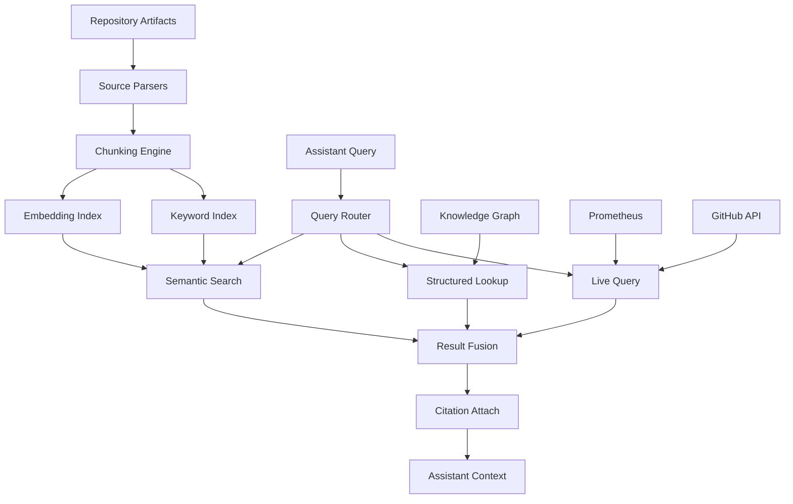

# Knowledge Retrieval Strategy

## Purpose

Define how AI assistants retrieve grounding context from repository artifacts. Every recommendation must identify its supporting sources — retrieval is the mechanism that makes this guarantee enforceable.

**Core principle:** Retrieval-augmented generation (RAG) with mandatory citation. An assistant claim without a retrieved source is flagged as ungrounded and excluded from recommendations.

---

## Retrieval Sources

| Source | Path | Content Type | Update Frequency | Priority |
|--------|------|-------------|-----------------|----------|
| ADRs | `docs/adr/` | Architectural decisions and constraints | On merge | Highest (constraints) |
| Runbooks | `docs/runbooks/` | Operational procedures | On merge | Highest (procedures) |
| Alert rules | `monitoring/prometheus/alerts.yml` | Alert definitions, thresholds, runbook links | On merge | High |
| Recording rules | `monitoring/prometheus/recording-rules.yml` | Metric semantics, SLO formulas | On merge | High |
| SLO definitions | `docs/sre/slos.md` | Targets, budgets, policy | On merge | High |
| Architecture docs | `docs/architecture/` | System design, data flows | On merge | High |
| Postmortems | `docs/postmortems/` | Incident history, causal patterns | On merge | High (incidents) |
| Terraform | `deploy/terraform/` | Infrastructure definitions | On merge | Medium |
| K8s manifests | `deploy/kubernetes/`, `deploy/helm/` | Workload configuration | On merge | Medium |
| Security docs | `docs/security/` | Threat model, IAM policy, secrets policy | On merge | High (security) |
| Operations docs | `docs/operations/` | On-call, severity, logging, tracing | On merge | Medium |
| Source code | `internal/`, `frontend/`, `cmd/` | Implementation truth | On merge | Medium |
| OpenAPI spec | `api/openapi.yaml` | API contract | On merge | Medium |
| CI workflows | `.github/workflows/` | Pipeline definitions | On merge | Medium |
| Metrics (live) | Prometheus API | Current system state | Real-time | High (live context) |
| Logs (live) | Loki API | Event history | Real-time | Medium (live context) |
| Git history | GitHub API | Deployments, changes, releases | Real-time | High (change context) |

---

## Indexing Architecture



### Chunking Strategy

| Source Type | Chunk Unit | Metadata Attached |
|-------------|-----------|------------------|
| Markdown docs | Section (by `##` header) | file path, section path, last-modified commit |
| YAML (alerts, rules) | Per rule/group | file path, rule name, line range |
| Terraform | Per resource block | module, resource type, resource name |
| Go source | Per function/type | package, file, exported status |
| JSON (dashboards) | Per panel | dashboard name, panel title, expressions |
| Postmortems | Per section (timeline, root cause, lessons) | incident ID, date, severity |

**Chunk size target:** 200-800 tokens. Oversized sections split on paragraph boundaries with overlap.

### Index Refresh

| Trigger | Action |
|---------|--------|
| Push to main | Incremental re-index of changed files |
| Weekly schedule | Full re-index (catches drift, validates integrity) |
| Manual trigger | Full re-index via CLI |

---

## Retrieval Patterns by Assistant

### Incident Assistant

| Query Intent | Retrieval Strategy |
|-------------|-------------------|
| "What does this alert mean?" | Structured: alerts.yml rule by name → annotations, threshold, runbook link |
| "What runbook applies?" | Structured: knowledge graph ALERT_HAS_RUNBOOK edge; fallback: semantic search over runbook titles + alert sections |
| "Has this happened before?" | Semantic: postmortem corpus filtered by affected service and alert names; return timeline + root cause sections |
| "What changed recently?" | Live: GitHub API releases + workflow runs in time window; structured: changed file → service mapping |
| "What are the causal chains?" | Structured: knowledge graph traversal from alert entity |

### Deployment Advisor

| Query Intent | Retrieval Strategy |
|-------------|-------------------|
| "What's the SLO budget state?" | Live: Prometheus query using formulas from slos.md |
| "What's in this changeset?" | Structured: PR diff file list → service/module mapping |
| "Were there recent rollbacks?" | Live: GitHub workflow runs with rollback markers |
| "What does policy say?" | Semantic: error budget policy section of slos.md + error-budget-burn runbook |

### Infrastructure Review

| Query Intent | Retrieval Strategy |
|-------------|-------------------|
| "Is this change consistent with security policy?" | Semantic: threat-model.md + iam-least-privilege.md sections relevant to resource type |
| "What's the cost baseline?" | Structured: cost/estimates.md table entries for affected resource types |
| "What pattern does this module follow?" | Semantic: existing module code for same resource type |

### Documentation Assistant

| Query Intent | Retrieval Strategy |
|-------------|-------------------|
| "What does the doc say vs. reality?" | Dual retrieval: doc section (semantic) + actual config (structured parse) |
| "Is an ADR needed?" | Semantic: ADR corpus for related decisions; structured: new package/module detection |

---

## Citation Requirements

Every retrieved chunk delivered to an assistant carries:

```yaml
citation:
  source_file: "docs/runbooks/provider-rate-limiting.md"
  section: "## Resolution"
  line_range: [14, 28]
  last_modified: "2024-02-10T14:22:00Z"   # commit timestamp
  commit: "a1b2c3d"
  retrieval_score: 0.87
```

**Enforcement:**
- Assistant output schema requires `evidence[]` array on every claim
- Claims with empty evidence are rendered as: "⚠️ Ungrounded assessment (no supporting source found)"
- Live metric citations include query + timestamp + value

---

## Grounding Guarantees

| Guarantee | Mechanism |
|-----------|-----------|
| No invented file paths | Citation validator checks file existence at cited commit |
| No stale context | Index freshness metadata; chunks older than refresh window flagged |
| No cross-contamination | Retrieval scoped per assistant (incident assistant cannot retrieve from cost docs unless explicitly queried) |
| Secrets never retrieved | Exclusion list: `.env*`, `*secrets*` values files, credentials paths filtered before indexing |
| Deterministic for same input | Fixed retrieval parameters (top-k, threshold) per query type; logged for reproducibility |

---

## Retrieval Quality Controls

| Control | Implementation |
|---------|---------------|
| Relevance threshold | Minimum similarity score 0.70; below threshold returns "no relevant sources found" |
| Recency weighting | For operational queries, sources from last 90 days boosted 1.5x |
| Authority ranking | ADRs and runbooks rank above general docs for procedural questions |
| Conflict detection | If top-2 retrieved chunks contradict, both surfaced with conflict flag |
| Coverage check | If query touches a service with no indexed sources, explicit gap reported |

---

## Failure Modes

| Failure | Behavior |
|---------|----------|
| Index unavailable | Assistants degrade to structured lookup only (knowledge graph + live queries); flag reduced confidence |
| Stale index detected | Warning attached to all outputs: "Index last updated {time} — verify against current state" |
| No relevant sources | Assistant states "No supporting documentation found" — never fills with general knowledge |
| Contradictory sources | Both presented; human resolution required; conflict logged for doc maintenance |

---

## Security Constraints

- Index contains no secrets (pre-index filtering validated by CI check against `.gitleaks.toml` patterns)
- Retrieval API is read-only; no write path exists
- Query logs retained for audit (see [13-governance.md](13-governance.md))
- Model never receives raw credentials, connection strings, or keys even if present in indexed files (regex scrubbing layer)
