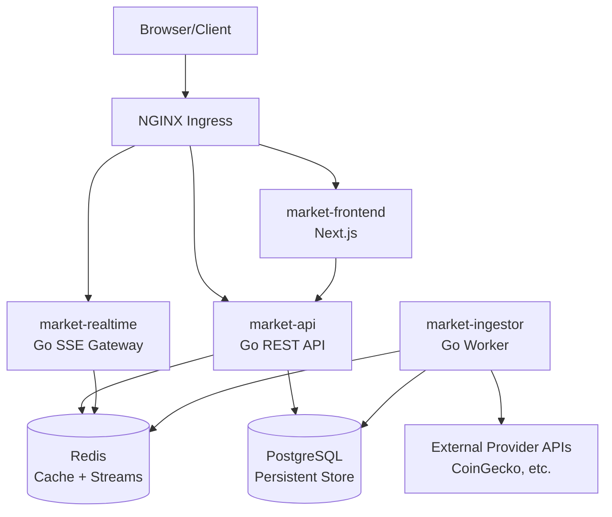
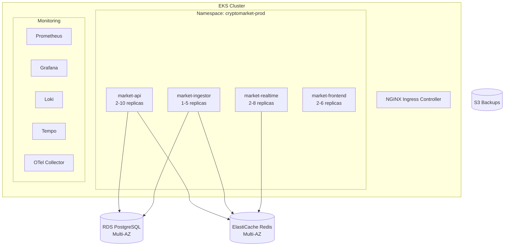
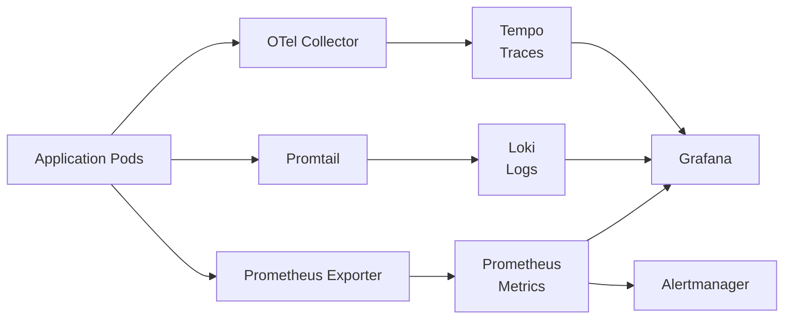

# Architecture Overview

## System Components

### market-api (Go)
REST API service that:
- Serves latest market data from Redis cache
- Falls back to PostgreSQL for historical queries
- Exposes health, readiness, and Prometheus metrics endpoints
- Uses structured JSON logging with request IDs

### market-ingestor (Go)
Background worker that:
- Periodically fetches market data from configured providers
- Validates and normalizes provider responses
- Persists snapshots to PostgreSQL
- Caches latest values in Redis
- Publishes price update events to Redis Streams
- Records synchronization outcomes

### Data Stores
- **PostgreSQL**: Persistent storage for coins, price snapshots, and sync logs
- **Redis**: Latest value cache (5min TTL) and event stream (Redis Streams)

## Data Flow

```
Provider API → Ingestor → PostgreSQL (history)
                       → Redis (latest cache)
                       → Redis Stream (events)

Client → API → Redis (latest)
            → PostgreSQL (history)
```

## Design Decisions

1. **Single Go module**: Avoids premature microservices complexity while maintaining clear package boundaries
2. **Interface-driven providers**: New providers can be added without changing business logic
3. **String-based prices**: Avoids floating-point precision loss for monetary values
4. **UTC timestamps**: All times stored and transmitted in UTC
5. **Parameterized SQL**: Prevents SQL injection; transactions for batch inserts
6. **Graceful shutdown**: Both services handle SIGINT/SIGTERM with context cancellation

## Package Structure

```
internal/
├── api/         HTTP handlers, middleware, routing
├── cache/       Redis cache and stream operations
├── config/      Environment-based configuration
├── market/      Domain models and validation
├── provider/    Provider interface and adapters
├── repository/  Database access layer
├── scheduler/   Periodic execution with overlap prevention
├── telemetry/   Structured logging and Prometheus metrics
└── worker/      Ingestion orchestration
```

## Logical Architecture



## Kubernetes Deployment View



## CI/CD Pipeline

```mermaid
graph LR
    Push[Git Push] --> Lint[Lint + Test]
    Lint --> Security[Security Scan<br/>Trivy, Gitleaks]
    Security --> Build[Docker Build + Push ECR]
    Build --> TF[Terraform Plan]
    TF --> Staging[Deploy Staging]
    Staging --> Smoke[Smoke Tests]
    Smoke --> Canary[Canary 5%]
    Canary --> V1[Verify]
    V1 --> C25[Canary 25%]
    C25 --> V2[Verify]
    V2 --> C50[Canary 50%]
    C50 --> V3[Verify]
    V3 --> Prod[Promote 100%]
```



## Terraform Module Structure

```mermaid
graph TB
    Env[environments/dev|staging|prod] --> Net[modules/networking<br/>VPC, Subnets, NAT]
    Env --> EKS_M[modules/eks<br/>Cluster, Node Groups]
    Env --> RDS_M[modules/rds<br/>PostgreSQL]
    Env --> Redis_M[modules/elasticache<br/>Redis]
    Env --> S3_M[modules/s3<br/>Buckets]
    Env --> IAM_M[modules/iam<br/>IRSA Roles]
    Env --> KMS_M[modules/kms<br/>Encryption]
    Env --> DNS_M[modules/dns<br/>Route53]
    Env --> ACM_M[modules/acm<br/>Certificates]
    Env --> Mon_M[modules/monitoring<br/>CloudWatch]
    Env --> Sec_M[modules/secrets<br/>Secrets Manager]
```

## Observability Stack


